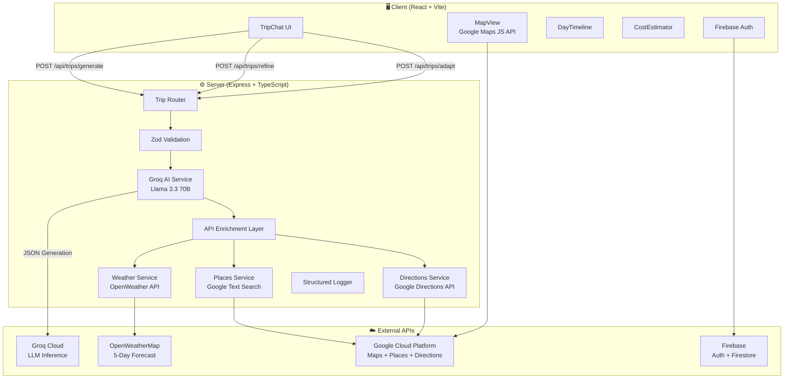
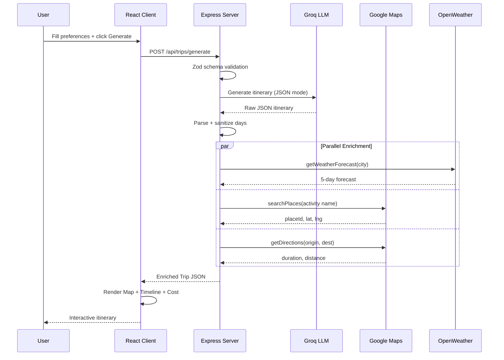
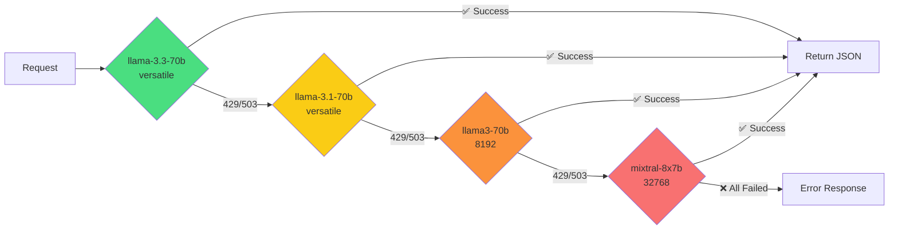

<p align="center">
  <h1 align="center">🌍 RoamGenie — AI-Powered Travel Itinerary Engine</h1>
  <p align="center">
    <em>Tell it where you are. It tells you where to go.</em>
  </p>
</p>

<p align="center">
  <a href="#-features">Features</a> •
  <a href="#-architecture">Architecture</a> •
  <a href="#-tech-stack">Tech Stack</a> •
  <a href="#-getting-started">Getting Started</a> •
  <a href="#-google-services">Google Services</a> •
  <a href="#-security">Security</a>
</p>

---

## 🎯 What is RoamGenie?

RoamGenie is a **full-stack AI travel planning engine** that generates hyper-personalized, multi-stop itineraries in seconds. Unlike traditional trip planners, RoamGenie doesn't need a destination — just your **current location**, **travel dates**, **budget in INR**, and **travel style**. The AI engine analyzes your preferences and crafts a complete day-by-day itinerary with real-time weather data, Google Maps coordinates, transit estimates, and a smart cost breakdown.

### The Problem
Planning a multi-city trip is painful: tourists spend 8+ hours researching across 10+ tabs, comparing weather, budgets, distances, and reviews — only to end up with an infeasible plan.

### The Solution
RoamGenie collapses this into a **single conversation**. You describe *who you are* as a traveler, and the AI handles the *where*, *when*, and *how much* — powered by LLM intelligence + Google Maps + OpenWeather enrichment.

---

## ✨ Features

| Feature | Description |
|---------|-------------|
| 🤖 **AI Itinerary Generation** | Llama 3.3 70B via Groq generates complete day-by-day plans in ~3 seconds |
| 🗺️ **Google Maps Integration** | Every place is enriched with real coordinates, Place IDs, and plotted on an interactive map |
| 🌦️ **Weather-Aware Planning** | OpenWeather API provides real forecasts; rainy days trigger adaptive re-planning |
| 💰 **INR Budget Engine** | Full cost estimation in Indian Rupees with category breakdown (food, transport, activities, etc.) |
| 🔄 **Conversational Refinement** | Chat to swap activities, change pace, add dietary restrictions — the AI updates the plan live |
| ⚡ **Multi-Model Fallback** | Automatic failover across 4 LLM models to guarantee uptime during rate limits |
| 🧭 **6 Trip Types** | Solo, Couple, Family, Bachelor, Office, Meet-in-Middle — each with tailored activity weights |
| 🔐 **Firebase Auth + Persistence** | Google Sign-In with trip save/load to Firestore |
| 🐳 **One-Command Deploy** | `docker compose up` launches the entire stack (server + client + nginx) |
| ♿ **Accessible UI** | ARIA labels, keyboard navigation, skip-to-content link, semantic HTML5 |

---

## 🏗️ Architecture

### System Overview



### Request Flow — Trip Generation



### Multi-Model Fallback Strategy



---

## 🛠️ Tech Stack

| Layer | Technology | Purpose |
|-------|-----------|---------|
| **Frontend** | React 18, TypeScript, Vite | SPA with reactive state management |
| **Maps** | `@vis.gl/react-google-maps` | Interactive Google Maps with AdvancedMarker pins |
| **Backend** | Express 4, TypeScript, tsx | REST API with hot-reload |
| **AI Engine** | Groq SDK (Llama 3.3 70B) | Sub-3-second itinerary generation with native JSON mode |
| **Validation** | Zod | Runtime schema validation on all API inputs |
| **Auth** | Firebase Auth | Google Sign-In with session persistence |
| **Storage** | Cloud Firestore | Trip save/load for authenticated users |
| **Weather** | OpenWeatherMap API | 5-day forecasts with 30-min in-memory cache |
| **Security** | Helmet, CORS, express-rate-limit | HTTP hardening + 30 req/min rate limiting |
| **Logging** | Custom structured logger | Leveled, JSON-formatted, module-scoped logs |
| **Container** | Docker, docker-compose, nginx | Multi-stage build, health checks, reverse proxy |

---

## 🚀 Getting Started

### Prerequisites
- Docker Desktop
- API Keys: Groq, Google Maps (Places + Directions enabled), OpenWeather, Firebase

### 1. Clone & Configure

```bash
git clone https://github.com/yourusername/RoamGenie.git
cd RoamGenie
```

Create `server/.env`:
```env
GROQ_API_KEY=gsk_your_key_here
GEMINI_API_KEY=your_gemini_key        # Optional fallback
GCP_MAPS_API_KEY=your_maps_key
OPENWEATHER_API_KEY=your_weather_key
PORT=9001
NODE_ENV=development
CORS_ORIGIN=http://localhost:9173
```

Create `client/.env`:
```env
VITE_API_URL=http://localhost:9001/api
VITE_GCP_MAPS_API_KEY=your_maps_key
VITE_FIREBASE_API_KEY=your_firebase_key
VITE_FIREBASE_AUTH_DOMAIN=your_project.firebaseapp.com
VITE_FIREBASE_PROJECT_ID=your_project_id
```

### 2. Launch

```bash
docker compose up --build -d
```

Open **http://localhost:9173** — that's it! 🚀

---

## 🗺️ Google Services Integration

| Service | API | Usage |
|---------|-----|-------|
| **Maps JavaScript API** | Client-side | Interactive map rendering with `AdvancedMarker` + category-colored `Pin` components |
| **Places API (Text Search)** | Server-side | Enriches AI-generated place names with real `placeId`, `lat/lng`, `address` |
| **Directions API** | Server-side | Calculates actual transit time and distance between sequential activities |
| **Firebase Authentication** | Client-side | Google Sign-In for trip persistence |
| **Cloud Firestore** | Client-side | Stores/loads saved trips per user |

---

## 🔒 Security

- **Helmet.js** — Sets secure HTTP headers (CSP, HSTS, X-Frame-Options, etc.)
- **CORS** — Strict origin whitelist (`CORS_ORIGIN` env var)
- **Rate Limiting** — 30 requests/minute per IP via `express-rate-limit`
- **Input Validation** — All API payloads validated through Zod schemas before processing
- **Error Sanitization** — Internal errors are never leaked to the client; generic messages returned
- **API Key Isolation** — All secrets in `.env` files, excluded from Docker context via `.dockerignore`
- **JSON Size Limit** — Request body capped at 1MB to prevent payload attacks

---

## ♿ Accessibility

- Skip-to-content link for keyboard users
- Semantic HTML5 (`<header>`, `<main>`, `<nav>`, `<article>`, `<aside>`)
- ARIA labels on all interactive elements and regions
- Keyboard-navigable activity cards with `tabIndex` and `onKeyDown` handlers
- Unique IDs on all buttons for automated browser testing
- Color-coded feasibility scores with text alternatives

---

## 🧪 Testing

```bash
# Run server unit tests
cd server && npm test

# Run with watch mode
cd server && npm run test:watch
```

---

## 📊 Efficiency

- **One-shot LLM Generation** — Single API call per trip (no multi-round tool-calling loops)
- **Parallel API Enrichment** — Weather, Places, and Directions calls run concurrently via `Promise.all`
- **Weather Caching** — 30-minute TTL in-memory cache eliminates redundant API calls
- **Multi-stage Docker Build** — Client built at compile time, served via nginx (no Node runtime in production)
- **Graceful Degradation** — If any enrichment API fails, AI-generated defaults are preserved (never crashes)

---

## 📁 Project Structure

```
RoamGenie/
├── client/                    # React + Vite frontend
│   ├── src/
│   │   ├── components/        # TripChat, MapView, DayTimeline, CostEstimator, ProfilePage
│   │   ├── hooks/             # useTrip, useAuth
│   │   ├── services/          # api.ts, firebase.ts
│   │   └── App.tsx            # Root component
│   └── .env                   # Client environment variables
├── server/                    # Express + TypeScript backend
│   ├── src/
│   │   ├── routes/            # trip.ts, weather.ts
│   │   ├── services/          # groq.ts, weather.ts
│   │   ├── middleware/        # validate.ts (Zod schemas)
│   │   └── utils/             # logger.ts
│   └── .env                   # Server environment variables
├── shared/                    # Shared TypeScript types
│   └── types/index.ts         # Trip, Activity, TripDay, etc.
├── Dockerfile                 # Multi-stage: server + client-build + nginx
├── docker-compose.yml         # Orchestration with health checks
└── nginx.conf                 # Reverse proxy configuration
```

---

## 📜 License

MIT © RoamGenie Contributors
